# 📅 Evently App

Evently is a comprehensive, production-ready Flutter application designed to help you discover, create, and manage events effortlessly. Built with a focus on high performance, clean code, and a seamless user experience.

---

## 📱 Screenshots

### Light Theme
| Home Tab | Favourites | Profile |
|----------|-----------|---------|
| 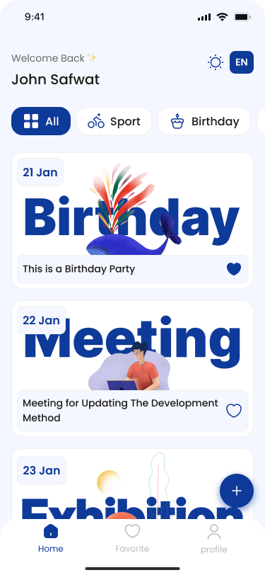 | 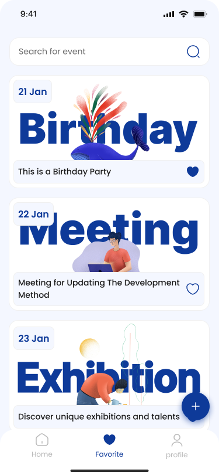 | 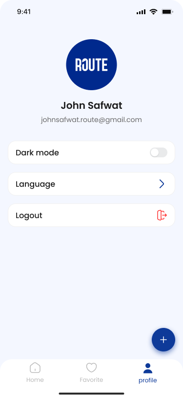 |

### Event Management
| Create Event | Event Details | Edit Event |
|-------------|---------------|-----------|
| 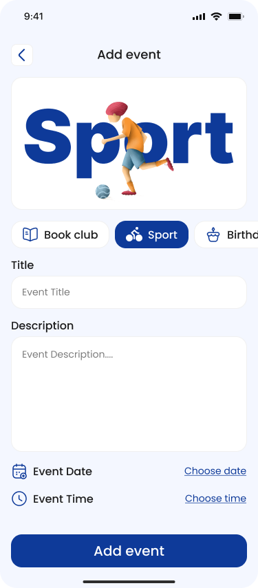 | 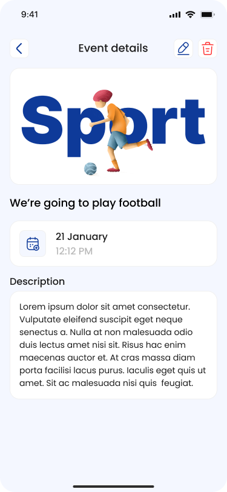 | 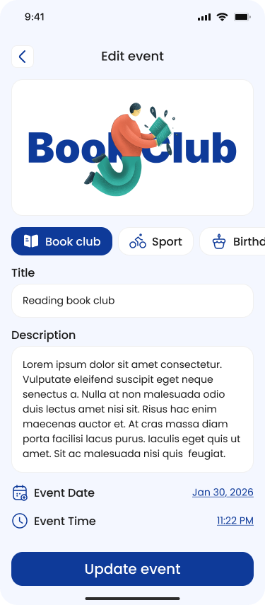 |

### Dark Theme
| Home Tab | Favourites | Profile |
|----------|-----------|---------|
| 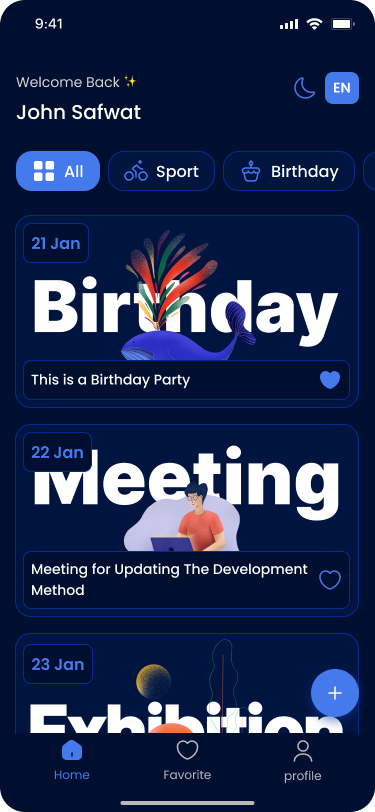 | 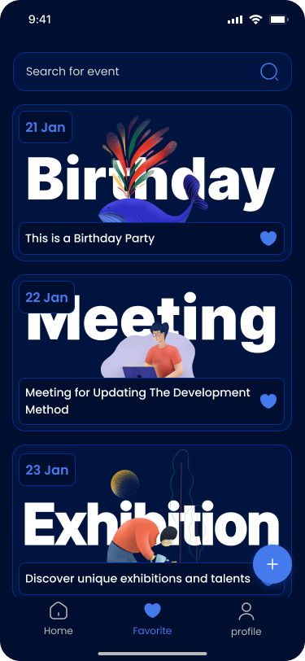 | 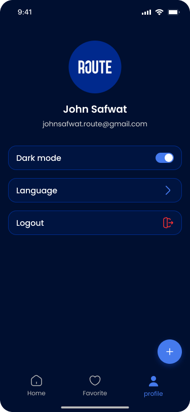 |

### Authentication
| Login | Register |
|-------|----------|
| 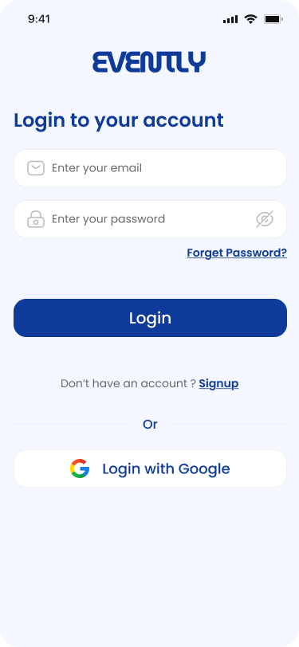 | 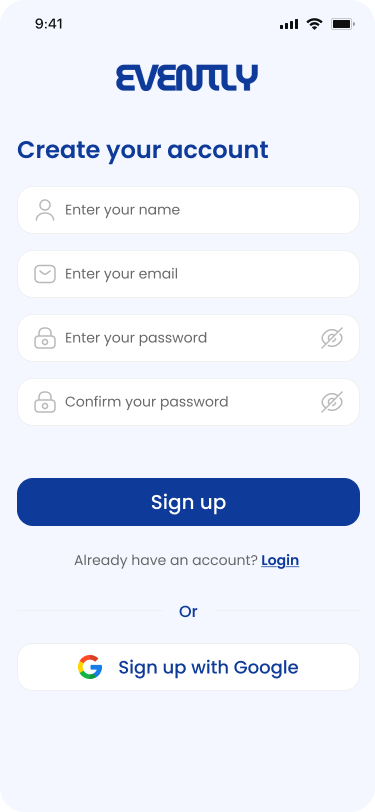 |

---

## ✨ Core Features

🏠 **Home Tab**: Discover events with advanced search and filtering capabilities to find exactly what you're looking for.

❤️ **Favourite Events**: Bookmark your favorite events for quick access and never miss out on what matters to you.

➕ **Create Event**: Easily create and publish new events with a user-friendly form supporting categories, dates, and times.

📋 **Event Details**: View comprehensive event information including descriptions, dates, times, and other attendees.

✏️ **Edit Events**: Modify your events after creation with full control over all event details.

👤 **User Profile**: Manage your account settings and preferences in one convenient location.

🌓 **Dark & Light Mode**: Switch between beautiful dark and light themes for comfortable viewing in any environment.

🌍 **Multi-Language Support**: Full support for English and Arabic with seamless language switching.

🔐 **Secure Authentication**: Firebase-backed authentication with email/password and Google Sign-In options.

---

## 🚀 Technical Stack

| Component | Technology |
|-----------|-----------|
| **Framework** | Flutter |
| **Architecture** | MVVM (Model-View-ViewModel) with clean code principles |
| **State Management** | Flutter BLoC (Cubit & Bloc) for predictable state handling |
| **Backend** | Firebase (Authentication & Cloud Firestore) |
| **Local Storage** | Shared Preferences for persistent user data |
| **Authentication** | Firebase Auth + Google Sign-In |
| **UI Framework** | Material Design 3 |
| **Networking** | Firebase REST APIs |
| **Localization** | Intl package for i18n (English & Arabic) |

---

## 🏗️ Project Structure

```
lib/
├── core/                    # Shared utilities and widgets
│   ├── config/             # App configuration (theme, colors)
│   ├── di/                 # Dependency Injection setup
│   ├── errors/             # Custom error handling
│   ├── extensions/         # Dart extensions
│   ├── utils/              # Utility classes (routes, validators, etc.)
│   └── widgets/            # Reusable custom widgets
├── features/               # Feature modules
│   ├── auth/               # Authentication (Login, Register)
│   │   ├── data/
│   │   ├── view_model/     # BLoC for auth state
│   │   └── views/
│   ├── home/               # Home screen with tabs
│   │   └── tabs/
│   │       ├── home_tab/       # Browse events
│   │       ├── favourite_tab/  # Saved events
│   │       └── profile_tab/    # User settings
│   ├── create_event/       # Create new events
│   │   ├── data/
│   │   ├── view_model/
│   │   └── views/
│   ├── event_details/      # View & edit event details
│   │   ├── data/
│   │   ├── view_model/
│   │   └── views/
│   └── ...                 # Other features
├── l10n/                   # Localization (i18n)
├── main.dart               # App entry point
└── pubspec.yaml            # Dependencies

```

---

## 🎯 Architecture Principles

- **MVVM Pattern**: Clear separation between View, ViewModel (BLoC), and Model layers
- **Dependency Injection**: GetIt for service locator pattern ensuring loose coupling
- **Repository Pattern**: Abstract data sources with repository implementations
- **Clean Code**: Meaningful naming, small functions, and single responsibility principle
- **Error Handling**: Dartz for functional error handling with Either pattern

---

## 📦 Key Dependencies

```yaml
# State Management
flutter_bloc: ^9.1.1          # Business Logic Component
equatable: ^2.0.8             # Value equality

# Firebase
firebase_core: ^4.6.0         # Firebase core
firebase_auth: ^6.3.0         # Authentication
cloud_firestore: ^6.2.0       # Database

# Authentication
google_sign_in: ^7.2.0        # Google Sign-In

# Local Storage
shared_preferences: ^2.5.3    # Key-value storage

# Dependency Injection
get_it: ^9.2.1                # Service locator

# Functional Programming
dartz: ^0.10.1                # Either, Option types

# UI
flutter_screenutil: ^5.9.3    # Responsive design
google_fonts: ^6.3.2          # Custom fonts
flutter_svg: ^2.2.4           # SVG support
flutter_native_splash: ^2.4.7 # Native splash screen

# Internationalization
intl: ^0.20.2                 # i18n support
flutter_localizations:        # Localization delegates

# Notifications
fluttertoast: ^9.0.0          # Toast messages
```

---

## 🚀 Getting Started

### Prerequisites
- Flutter SDK 3.8.1 or higher
- Dart 3.8.1 or higher
- Firebase project setup
- Android Studio / Xcode for native builds

### Installation

1. **Clone the repository**
   ```bash
   git clone https://github.com/Ahmed-Elmekawy/Evently_App.git
   cd evently_app
   ```

2. **Install dependencies**
   ```bash
   flutter pub get
   ```

3. **Generate localization files**
   ```bash
   flutter gen-l10n
   ```

4. **Configure Firebase**
   - Add your Firebase configuration files
   - Update `google-services.json` (Android)
   - Update `GoogleService-Info.plist` (iOS)

5. **Run the app**
   ```bash
   flutter run
   ```

---

## 🔧 Build & Deployment

### Debug Build
```bash
flutter run
```

### Release Build (Android)
```bash
flutter build apk --release
# or for App Bundle
flutter build appbundle --release
```

### Release Build (iOS)
```bash
flutter build ios --release
```